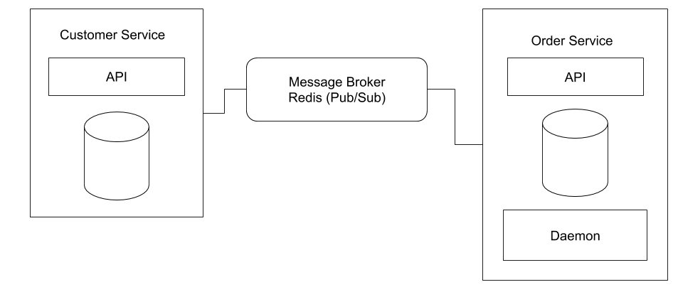

# Microservice Messaging

This is a very basic example of how to implement a messaging system for a microservice architecture using Redis, Symfony, and Docker.

The complete system is divided into Customer Service, Order Service, and a Message Broker. Check below more details about each service. 

## Customer Service

It is responsible by managing customer's data. It stores data in a MySQL database table and provides a REST api containing two endpoints, one for creating a customer and one for listing existing customers.

This service is connected into Redis for publishing a message when new customers are added. This message will be used later by the Order Service for adding an order for this customer.

## Order Service

It is responsible by managing order's data. It stores data in a MySQL database table and provides a REST api containing a single endpoint for listing all the existing orders.

This service contains a daemon system, which subscribes into Redis in order to be notified as soon as a new customer is added. Then, it adds the new order on database for the customer.

## Message Broker (Redis)

Redis comes with a powerful pub/sub system, so here it is used in order to publish and subscribe into a particular channel for making the isolated systems talk to each other.

## Running

For running this all you need is Docker installed on your machine. This project comes with a `docker-compose.yaml` containing all the configuration for running the services.

You should run `docker-compose up` from inside of the root folder. Docker will map the port 8881 with the order application and 8882 with the customer application.

You will have the endpoints below to play:

- GET | http://localhost:8881/api/orders
- GET | http://localhost:8882/api/customers
- POST | http://localhost:8882/api/customer - parameters name, surname, total, status.

Notice that you are also sending some information that is not related to the customer (total and status) this is because imagine that you are ready to send your order but first you must register a new user for the visitor. After registering the new user you must send a message to Redis containing the order details.

Also, you must execute the daemon application, for this follow the steps below:
- Run `docker exec -ti CONTAINER_ID bash`
- Navigate into `/var/www/html/app`
- Run `php index.php`

All done, have fun!